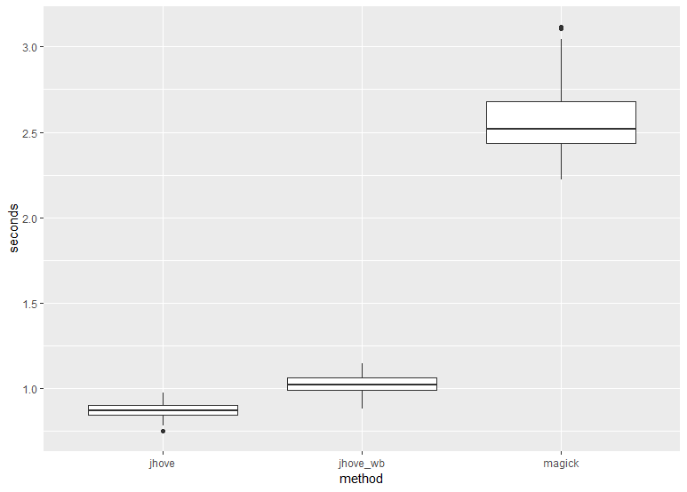

# Image validation

Some tests for image validation.

## Time to validate

Using the script `speedtest.sh`, we compared the speed of checking for valid TIF files using 50 images from a DPO Mass Digitization project. The images were in the local system and this was run on an Ubuntu 16.04 machine. 

The images were checked using three methods:

 * JHOVE 1.20.1
 * [JHOVE WB wrapper](../JHOVE%20wrapper)
 * Imagemagick 6.8.9-9

## Results

Method | Seconds (mean)
------ | ------------
JHOVE | 0.870
JHOVE WB wrapper | 1.02
Imagemagick | 2.58

Results were pretty consistent:

See the file [`results.csv`](results.csv) for the full list of results.
